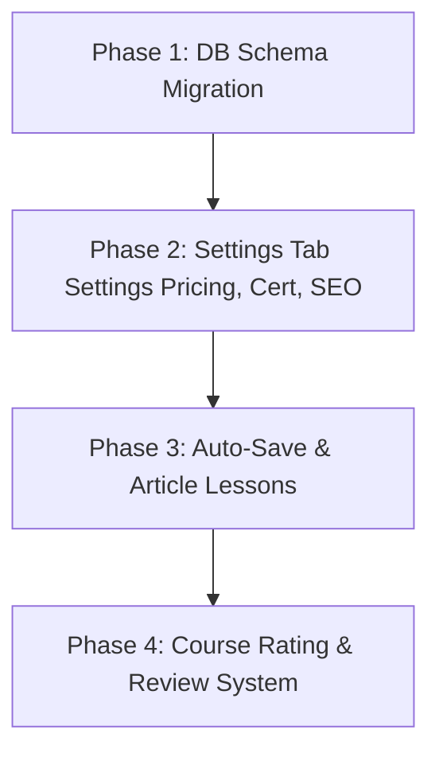

# Sparring Review & Technical Architecture: CSCN Course Builder Improvements

This document provides a critical sparring review of the proposed Course Builder improvements, detailing how we can implement them to meet world-class LMS standards.

---

## 1. Sparring Critique of the Proposed Improvements

### 1.1 Auto-Save in Lesson Editor
* **Our Assessment:** **Absolute priority.** Instructors hate manually pressing "Save". If their browser crashes or tab closes, lost work destroys creator trust. 
* **The Pitch:** We will introduce a **debounced auto-save engine** (2-second inactivity delay) in the lesson editor. We will show a subtle, premium status indicator at the top right of the editor:
  * `● Unsaved changes` (orange)
  * `⟳ Saving...` (animating blue spinner)
  * `✓ Saved to cloud` (green checkmark)
* **Under the Hood:** Triggered by React state changes on inputs, calling our backend Server Actions in the background via a custom hook.

### 1.2 Course Pricing Field
* **Our Assessment:** Essential. Although the platform may launch with a subscription/cohort model, pricing flexibility (free vs. premium standalone vs. subscription-access) must be built into the core.
* **Current State:** The database `Course` model already defines a nullable `price Decimal? @db.Decimal(10,2)` field!
* **The Pitch:** We just need to implement the UI inputs in the Course **Settings** tab. We should support local currency representations (e.g., Nigerian Naira `₦` and US Dollars `$`) using our custom styled dropdowns.

### 1.3 Certificate Toggle ("Award certificate on completion")
* **Our Assessment:** Necessary. Gamification and resumes drive online completion rates. 
* **The Pitch:** We will add a boolean flag `certificateEnabled` to the `Course` model. This flag will dictate whether the student gets a "Download Certificate" button on their learnings tab upon reaching 100% course progress.

### 1.4 Lesson Content Formats (Expanding past Video)
* **Our Assessment:** Crucial for course variety. Video fatigue is real. Rich text, cheat sheets, guides, and download links are standard.
* **The Pitch:** We currently have a `ContentType` enum in our database (`VIDEO`, `ARTICLE`, `QUIZ`). We will implement `ARTICLE` lessons using a beautiful, clean, glassmorphic Rich-Text input. The content will save to a `bodyContent` field on the `Lesson` database model.

### 1.5 SEO Fields (metaTitle and metaDescription)
* **Our Assessment:** Highly recommended. Instructors want their courses to rank on Google. Letting them optimize their title and description tags is a standard requirement for organic growth.
* **The Pitch:** Add `metaTitle` and `metaDescription` fields directly to the `Course` schema and integrate them into Next.js SEO metadata generation.

---

## 2. Dynamic Course Ratings & Star Reviews (Critical Addition)

Currently, the Prisma database has a model named `CourseReview` which tracks administrative approval/moderation states (APPROVED, CHANGES_REQUESTED, REJECTED). It does **not** track student course reviews. We need to create a dedicated table for student ratings.

### Proposed Prisma Schema Expansion
We will add `CourseRating` to store stars and comments:

```prisma
model CourseRating {
  id         String   @id @default(cuid())
  courseId   String
  studentId  String
  rating     Int      // Integer 1 to 5
  comment    String?  @db.Text
  createdAt  DateTime @default(now())
  updatedAt  DateTime @updatedAt

  course     Course   @relation(fields: [courseId], references: [id], onDelete: Cascade)
  student    User     @relation(fields: [studentId], references: [id], onDelete: Cascade)

  @@unique([studentId, courseId])
  @@index([courseId])
}
```

We will then compute and cache the average stars dynamically in the existing `LeaderboardCache` or display it directly using a Prisma aggregation call:
```typescript
const aggregations = await db.courseRating.aggregate({
  where: { courseId },
  _avg: { rating: true },
  _count: { rating: true }
});
```

---

## 3. Recommended Phased Implementation Plan

To deploy these changes cleanly without breaking the build, we will structure the development in three phases:



### Phase 1: Database Migration
Add the necessary columns to `schema.prisma`:
1. `certificateEnabled` (Boolean, default: false) on `Course`
2. `metaTitle` / `metaDescription` (String, nullable) on `Course`
3. `bodyContent` (String, text, nullable) on `Lesson`
4. The `CourseRating` table for student reviews.

### Phase 2: Course Settings UI Update
Update the Settings tab within the Instructor Dashboard Course Builder to include:
* Pricing options (Free vs. Paid input field).
* Certificate on Completion checkbox.
* Search Engine Optimization (SEO) cards.

### Phase 3: Auto-Save & Rich-Text Articles
* Integrate the debounced save hook in `LessonEditor.tsx`.
* Add custom rich-text block inputs when `contentType === "ARTICLE"`.

### Phase 4: Student Reviews & Learner Progress
* Add rating stars inputs on the Course Watch page upon completion.
* Render stars and average count on "My Learnings" and course cards.

---

  Then also this 
  ## 4. What Claude Missed: The Missing Pillars of a World-Class LMS

  To elevate CSCN Academy to a world-class standard on par with platforms like Coursera and Udemy, the following key elements should be added to the builder and player:

  ### 4.1 Granular Progress Telemetry (Resume Playback)
  * **The Gap:** Right now, we only track `completedAt` on `LessonProgress` (a binary yes/no). 
  * **The Upgrade:** A premium LMS needs to track the exact playback position (`lastSeekTime` in seconds) and `percentComplete` (e.g. 78%). 
    * **UX Value:** The student can click "Resume" on any course and start exactly where they paused.
    * **Instructor Value:** Generates watch-time drop-off charts (e.g., "90% of students stop watching after minute 4 of Lesson 2").

  My View: I don't know how we are going to go about this. How are we going to track where a user stopped and note we are using mux for our video upload unless you intend to use something better but kind of free. Then for the analytics how are we going to to about it to tell the instructor okay people dropped off at this partical section or lesson or minute
  

  ### 4.2 Lesson-Level Draft vs. Published States
  * **The Gap:** Currently, if a course is published, any changes or additions to modules/lessons immediately go live.
  * **The Upgrade:** Introduce an `isPublished` (Boolean, default: false) on `Lesson` and `Module`.
    * **Value:** Allows instructors to draft new sections or update lessons for an existing course without confusing current students, then release them in a single click.

  My View: So how are we going to go about this, because how we carfted the logic is that when an instructor is done creating the course they send for review and once sent they can't edit the course and when published does it mean the user will have to go back to resubmit that already published course for review and how will the admin spot the difference. Tell me what you think
  

  ### 4.3 Resource Upload & Management UI
  * **The Gap:** While the Prisma schema defines a `LessonResource` model (for PDFs, links, ZIP files), the curriculum editor lacks a dedicated drag-and-drop resource upload and management tray.
  * **The Upgrade:** Build a "Resources" manager inside `LessonEditor` where files can be uploaded directly to cloud storage and linked to the lesson.
  My view: Then this one, let's see how to go about what kind of resource will an instructor create 

  ### 4.4 Private Timestamped Bookmarks / Notes
  * **The Gap:** Students have no way to take notes during long videos.
  * **The Upgrade:** Allow students to write private notes that get auto-linked to the current video timestamp (e.g., "Note at 14:02 - pay attention to database indexing"). Clicking the note jumps the player directly to that time.
  
  My view: Wow I would love to see how you intend to achieve this one 

  So also think about this 

  ABOVE ARE THE FIXES AND THE THINGS I NEED YOU TO THINK ABOUT IT TELL ME ABOUT WHAT YOU THINK AND HOW WE ARE GOING TO GO ABOUT IT AND YOUR HONEST FEEDBACK AND WHAT'S THE PLAN ON HOW TO GO ABOUT EACH OF THESE REQUEST. DON'T CODE LET'S JUST ANALYSIS AND WAIT FOR FEEDBACK
  NOTE THIS ARE ANTIGRAVITY'S VIEW ON WHERE IT THINKED CLAUDE MISSED. sO LET'S THINK ABOUT IT AND TALK


  ----------------------
  You’re thinking in the right direction. The key is to **not turn resources into a whole blogging platform too early**, but still give them enough structure to feel premium and useful.

My honest recommendation: make resources a **lightweight guide/asset system**, not a full blog.

**1. Thumbnail Should Be Required**
Yes. I agree strongly.

For public/lead-magnet resources especially, thumbnail should be required because it is the “cover” of the resource. It affects trust, clicks, and perceived quality.

I’d support:
- Upload thumbnail
- Choose from generated AI thumbnail
- Maybe later: simple cover builder with title + background image + brand styling

But I would not block private/course-only resources with thumbnails. For those, thumbnail can be optional. For public/free/lead-magnet resources, required.

**2. Homepage Or Specific Page?**
Both, but with hierarchy.

I would create a dedicated public page:

`/resources`

This becomes the full resource library: guides, PDFs, templates, checklists, free downloads, lead magnets.

Then the homepage only shows a curated section:

“Free Resources”
Maybe 3 to 6 featured resources, like DeepLearning.AI.

So:
- Homepage = showcase / teaser
- `/resources` = searchable public library
- `/resources/[slug]` = individual resource/guide page

That keeps the homepage clean and prevents it from becoming cluttered.

**3. Should Free Ones Have A Detail Page?**
Yes, but not every resource needs the same detail page.

I’d split resources into two presentation types:

`Download Resource`
Example: PDF, template, worksheet, checklist.
Page has thumbnail, title, description, email capture/download button, related courses.

`Guide Resource`
Example: Natural Language Processing guide, AI prompting guide.
Page has article body, table of contents, thumbnail/hero image, related course CTA.

So yes, a free guide can have a course-detail-like page, but simpler.

**4. Should We Have An Editor?**
Yes, but a focused one.

Since we already have the Tiptap article editor, we can reuse the same editor foundation. But we should guide the instructor with a resource creation flow:

Step 1: Basics
Title, slug, summary, category, thumbnail.

Step 2: Resource Type
- File download
- External link
- Written guide

Step 3: Access
- Private
- Course-only
- Public free
- Lead magnet

Step 4: Content
- Upload file, paste link, or write guide.

For guide resources, yes:
- Title
- Thumbnail
- Article body editor
- Auto-generated table of contents from headings
- Optional “related course”
- CTA block

**5. Don’t Complicate It**
The simplest clean version:

First phase:
- Instructor can create a resource from dashboard.
- Resource can be `Private`, `Course-only`, `Public free`, or `Lead magnet`.
- Thumbnail required only for public/lead magnet.
- Resource type: `File`, `Link`, or `Guide`.
- Public resources show on `/resources`.
- Featured resources can appear on homepage manually or by admin approval.

Later:
- AI thumbnail generation.
- Paid resources.
- Advanced email capture automation.
- Resource analytics dashboard.
- Admin featured-resource curation.

**My Suggested Product Rule**
A resource should answer one of three jobs:

- “Help my students complete a lesson” → Course-only
- “Help me attract new learners” → Lead magnet
- “Help the public learn something valuable” → Public guide

That keeps the system clear.

If we build it this way, it feels world-class without becoming bloated.